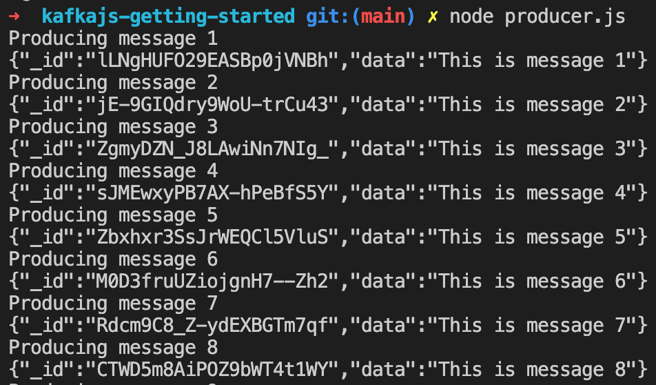
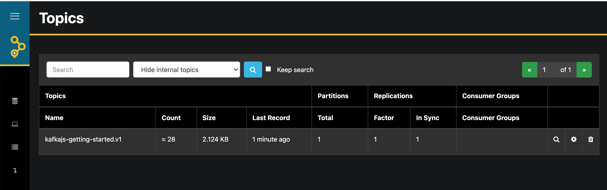

# kafkajs-getting-started

Simple getting started example for KafkaJS.

## Install

```bash
$ git clone [THIS-REPO]
$ cd kafkajs-getting-started
$ npm i
```

## Getting started

1. Copy `.env.example` to a new `.env` file. You can leave the default values or choose new ones.

```bash
$ cp .env.example .env
```

2. Start Kafka locally. The `docker-compose` file will already create the topic defined in `KAFKA_TOPIC` and advertise a listener on `localhost:9092`.

```bash
$ docker-compose up -d
```

## Producer

1. Start the producer. This will start sending messages every 500ms.

```bash
$ npm run start:producer
```

2. You'll start seeing the produced messages in the console.

   

## Consumer

1. Start the consumer.

```bash
$ npm run start:consumer
```

2. You'll start seeing the consumed messages in the console.

   

## AKHQ

1. Explore the topic messages in a UI using [akhq](https://akhq.io/). The `docker-compose` file in this repo already starts `akhq` for you. Browse to http://localhost:4001. You'll see the topic you defined for `KAFKA_TOPIC` in the `.env` file.



## Teardown

1. Stop Kafka locally

```bash
$ docker-compose down
```
