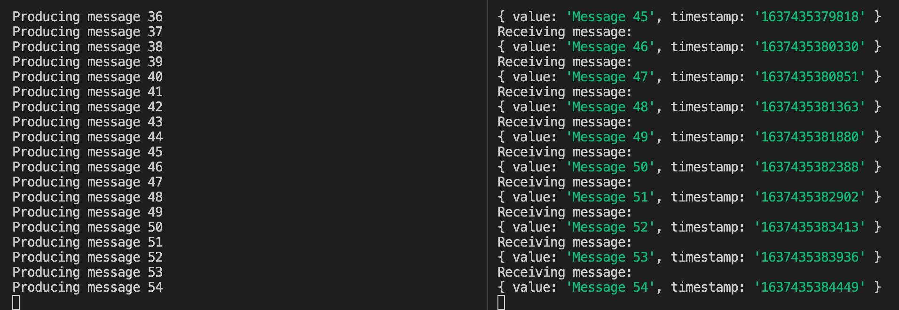

# kafkajs-getting-started

Simple getting started example for KafkaJS.

## Install

```bash
$ git clone [THIS-REPO]
$ cd kafkajs-getting-started
$ npm i
```

## Usage

1. Start Kafka locally

```bash
$ docker-compose up -d
```

2. Split your terminal. Start the producer in the left panel. This will start sending messages every 500ms.

```bash
$ npm run start:producer
```

3. Start the consumer in the right panel.

```bash
$ npm run start:consumer
```

4. You'll start seeing the consumer printing the messages that the producer is sending.
   

5. Stop Kafka

```bash
$ docker-compose down
```
